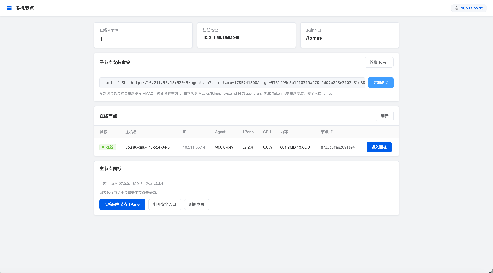
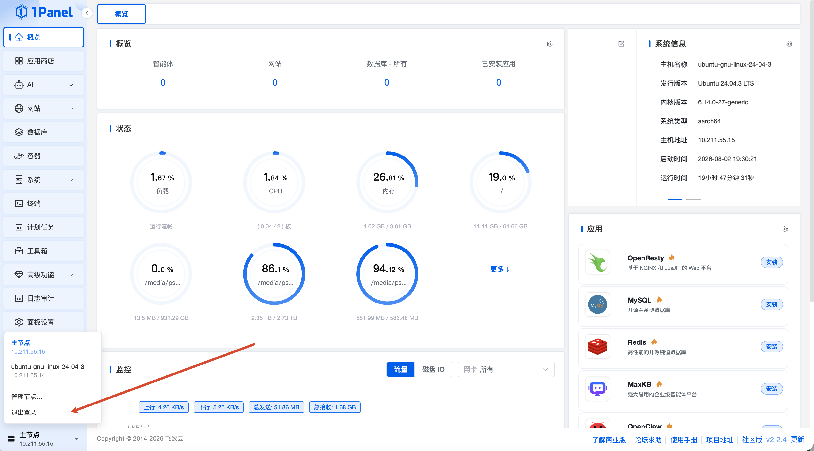

# 1pm

**1Panel 社区版多机网关** — 用一台 Master 统一入口，把多台 Agent 上的 1Panel 接到同一个浏览器会话里切换使用。

> 安装名使用 `1pm`，避免与官方二进制 `/usr/bin/1panel-agent` 冲突。  
> 本项目与 [1Panel](https://1panel.cn) / FIT2CLOUD **无官方关联**，是社区向的独立实现。

---

## 它解决什么问题

社区版 1Panel **没有**官方多机管理（节点管理属于[专业版 / 企业版](https://1panel.cn/docs/v2/user_manual/xpack/node/)）。  
如果你只想：

- 一台面板当入口，管理多台机器上的 1Panel  
- 子机在 NAT / 防火墙后面，**子机主动连出**即可  
- 不想买专业版许可证  

那 1pm 就是为这个场景写的。

---

## 与官网「节点管理」对比

| | **1pm（本项目）** | **1Panel 官方节点管理** |
|---|---|---|
| **授权** | MIT 开源，社区版可用 | 专业版 / 企业版许可证 |
| **接入方向** | Agent **出站**连 Master（类 FRP） | 主节点 **入站**连子节点（SSH + Agent 端口，默认 9999） |
| **NAT / 家庭宽带** | 友好（子机只需能访问 Master） | 主节点必须能 SSH 到子机，且打通 Agent 端口 |
| **安装方式** | Master 一键脚本；Agent 复制签名 `curl \| bash` | 主节点 UI 填 SSH 账号/密钥添加节点 |
| **面板切换** | Cookie 选节点 + 根路径反代；Agent 侧自动登录 | 面板内原生节点切换，深度集成 |
| **资源监控** | 管理页轮询 CPU / 内存 / 版本 | CPU / 内存 / 磁盘 / 网络等完整监控 |
| **配置同步** | ❌ | ✅ 代理、告警、应用仓库、备份账号等 |
| **文件互传** | ❌ | ✅ |
| **批量更新 / 分组 / 概览** | ❌ | ✅ |
| **数据库主从 / 集群** | ❌ | ✅（商业版能力） |
| **适用版本** | 各节点保持 **社区版** 即可 | 按许可证授权节点类型 |
| **复杂度** | 轻量：一个二进制 + systemd | 官方完整产品能力 |

**一句话**：官方适合要「完整多机运维平台」且愿意付费的用户；1pm 适合社区版用户、只要「统一入口切面板」，尤其是子机在 NAT 后面的场景。

---

## 界面预览

### 多机节点管理页（`/__mp/`）

在线 Agent、签名安装命令、CPU/内存与版本一览：



### 侧栏节点切换

注入到 1Panel 侧栏底部：主节点 / 子节点一键切换，并可进入「管理节点…」：



---

## 功能特性

- **Master 端口接管**：占用原 1Panel 公网端口，本机面板迁到内部端口，对外仍是一个入口  
- **Agent 反向隧道**：WebSocket + smux 多路复用，子机主动注册  
- **HMAC 安装命令**：`timestamp + sign`，约 5 分钟有效，可一键复制重新签发  
- **节点管理页** `/__mp/`：在线列表、Agent/1Panel 版本、CPU/内存（约 5 秒刷新）  
- **一键进入子机面板**：切走时本机会话暂存到 Master 内存；Agent 自动登录并覆盖浏览器 Cookie；切回时从 Master 恢复本机会话  
- **侧栏入口注入**：本机 1Panel HTML 注入节点切换与「管理节点」  
- **角色互斥**：同一台机器不能同时装 Master 与 Agent；`1pm uninstall` 自动识别卸载  

---

## 架构

```text
Browser ──▶ Master(:原 1Panel 端口)
              │
              ├─ /__mp/           节点管理 UI（需本机 1Panel 已登录）
              ├─ /agent/ws        Agent 接入（HMAC）
              ├─ /agent.sh|.bin   签名下载安装脚本 / 二进制
              ├─ mp_node 已选中   → 根路径隧道反代到 Agent 本机 1Panel
              └─ 默认             → 反代本机 1Panel（127.0.0.1:内部端口）

Agent ── WebSocket + HMAC ──▶ Master
         └── smux：HTTP / WebSocket / Stats
```

---

## 环境要求

- Linux（systemd），`amd64` / `arm64`  
- 本机已安装并初始化 [1Panel](https://1panel.cn)（需 `1pctl` / `1panel`）  
- Master 与 Agent **各占一台机器**（禁止同机双角色）  
- Agent 需能访问 Master 的面板端口（HTTP；若在 1Panel 开启了面板 SSL，则为 HTTPS / wss，证书继承自 `{1pctl BASE_DIR}/1panel/secret`）  

---

## 快速开始

### 1. 安装 Master

**推荐（Release 附件，经代理；避免 jsDelivr `@main` 永久缓存旧脚本）**

```bash
curl -fsSL https://gh-proxy.com/https://github.com/AnkioTomas/1panel-agent/releases/latest/download/install.sh | sudo bash
```

**jsDelivr（必须钉版本 tag，不要写 `@main`）**

```bash
curl -fsSL https://cdn.jsdelivr.net/gh/AnkioTomas/1panel-agent@v0.0.3/install.sh | sudo bash
```

脚本用 `checksums.txt` 探测哪个代理真能下 Release，再下二进制。`@main` 在 jsDelivr 上会永久缓存第一次内容——你之前看到的 `安装 ==> latest release` 就是旧脚本把日志吃进版本号了。

可选环境变量：`INSTALL_CDN=auto|global|cn`、`VERSION=v0.1.0`。

### 2. 打开管理页

1. 先登录 **本机** 1Panel（安全入口照常）  
2. 打开：`http(s)://<master>:<面板端口>/__mp/`  
   或使用侧栏「管理节点…」  
   （面板开启 SSL 后 Master 自动 HTTPS；HTTP 会 307 跳转。开 SSL 后请用新安装命令装 Agent，或给已有 Agent 设 `master_tls: true` 并重启。）  

### 3. 安装 Agent

在管理页点「复制命令」，到 **另一台** 机器执行（需本机 1Panel 密码，用于远程自动登录）：

```bash
curl -fsSL "http://<master>:<port>/agent.sh?timestamp=...&sign=..." | sudo bash
```

安装脚本会：下载二进制 → 写入配置 → 加密保存面板密码 → 启动 `1pm-agent.service`。

### 4. 切换节点

- 管理页点「进入面板」，或侧栏弹出列表选择子节点  
- 切回主节点：侧栏选「主节点」，或管理页「切换回主节点 1Panel」

---

## 卸载

自动识别本机角色（Master / Agent / 两者）：

```bash
sudo 1pm uninstall
```

---

## 构建与发布

```bash
# 本地
go build -o bin/1pm ./cmd/1panel-agent

# 交叉编译（示例）
CGO_ENABLED=0 GOOS=linux GOARCH=arm64 go build -trimpath \
  -ldflags="-s -w -X 1panel-agent/internal/buildinfo.Version=v0.1.0" \
  -o bin/1pm_linux_arm64 ./cmd/1panel-agent
```

推送版本 tag 后，GitHub Actions 会构建 Release（`linux/darwin` × `amd64/arm64` + `checksums.txt` + `install.sh`）：

```bash
git tag v0.1.0
git push origin v0.1.0
```

```bash
go test ./...
```

---

## 配置与路径

| 项 | 说明 |
|----|------|
| Master 状态 | `/var/lib/1pm/master.json`（Token、原端口、内部端口等） |
| Agent 配置 | `/root/.1panel-agent/agent.json`（Master、Token、面板地址等） |
| Agent 密码 | AES-GCM 加密落盘；密钥 `secret.key`（同目录） |
| 安装命令 Host | 打开 `/__mp/` 时的请求 `Host`，可用配置覆盖 `public_host` |
| `/__mp/` 鉴权 | 复用本机 1Panel 登录 Cookie → 签发 `mp_auth`，Master **不存**主节点密码 |

更多细节见 [`docs/`](docs/README.md)。

---

## 文档

| 文档 | 内容 |
|------|------|
| [architecture.md](docs/architecture.md) | 架构与目录结构 |
| [flow.md](docs/flow.md) | Takeover / 隧道 / 鉴权 / Cookie 隔离等流程 |
| [data_structures.md](docs/data_structures.md) | 核心数据结构与协议帧 |
| [http_api.md](docs/http_api.md) | HTTP API |
| [cli.md](docs/cli.md) | CLI 参考 |
| [design_notes.md](docs/design_notes.md) | 设计决策 |

---

## 限制与注意

- **不是**官方专业版替代品：无配置同步、文件互传、批量升级、节点分组等  
- Takeover 会修改本机 1Panel `ServerPort` 并重启 `1panel-core`；卸载时会尝试恢复  
- 安装命令签名约 **5 分钟**有效；复制按钮会重新向接口签发  
- Token 轮换后，旧 Agent 全部失效，需重新执行安装命令  
- 仅建议在可信网络或 VPN 后使用；Agent 下载与 WS 依赖共享 Token 的 HMAC  

---

## License

[MIT](LICENSE) © 2026 AnkioTomas
